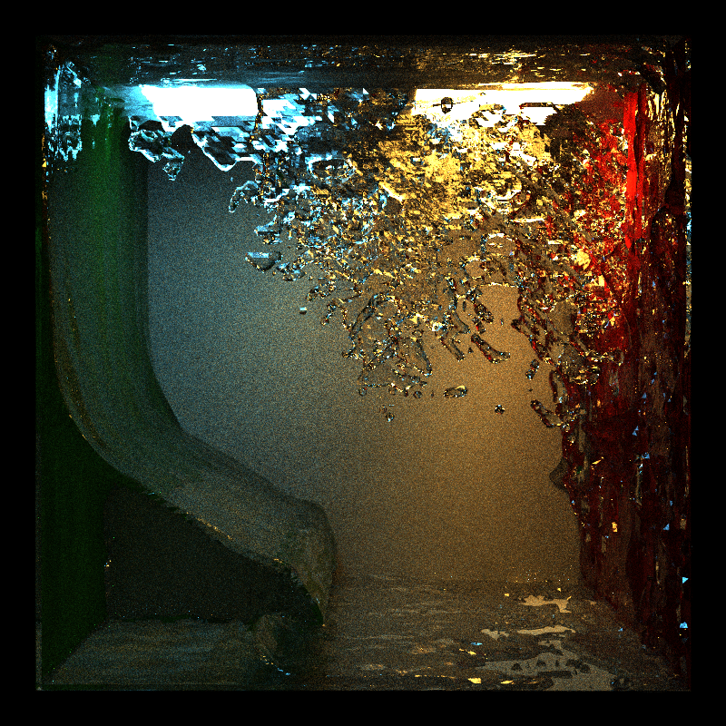

# libfluid

PIC/FLIP/APIC fluid simulation library with a built-in bidirectional path tracer and a Maya plugin.

## Buliding libfluid

libfluid uses CMake and requires a C++17-compliant compiler. Building has been tested on Visual Studio 2019 and g++ 8.1.0. The library itself does not require any extra dependencies. libfluid also includes a bidirectional path tracer that is built if `FLUID_BUILD_RENDERER` is `ON`.

### The testbed

The repository also includes a testbed, which is built depending on the value of `FLUID_BUILD_TESTBED` (`ON` by default). The testbed requires `GLU` and `GLFW`.

### Maya plugin

The building of the Maya plugin is dependent on the variable `FLUID_BUILD_MAYA_PLUGIN`. The variable `FLUID_MAYA_DEVKIT_PATH` should be set to point to the Maya devkit directory that contains the `include` and `lib` directories.

## Testbed controls

Note: these controls may or may not be up-to-date. See `key_callback()` in [`main.cpp`](testbed/main.cpp) for controls actually implemented in the testbed.

### Simulation Controls

| Key | Description |
|-|-|
| Enter | Start / pause fluid simulation |
| R | Reset simulation |
| Spacebar | Step simulation |
| P | Toggle particle visualization |
| C | Toggle cell occupation visualization |
| F | Toggle face velocity visualization |
| M | Toggle mesh visibility |
| A | Toggle APIC debug visualization |
| F1 | Cycle particle visualization mode |
| F2 | Cycle mesh visualization mode |
| F3 | Save fluid mesh to `mesh.obj` |
| F4 | Save particles to `points.txt` |
| 5 | Set simulation setup 4 |
| 6 | Set simulation setup 3 |
| 7 | Set simulation setup 2 |
| 8 | Set simulation setup 1 |
| 9 | Set simulation setup 0 |

### Render Controls

| Key | Description |
|-|-|
| V | Toggle render preview visibility |
| S | Start / pause render preview sampling |
| 0 | Load current water simulation for rendering |
| 1 | Load Cornell box scene for rendering |
| 2 | Load glass sphere scene for rendering |
| F5 | Render high-resolution high-sample-count image to `test.ppm` |
| F6 | Save render preview to `test.ppm` |

## Acknowledgements

- [`rlguy/GridFluidSim3D`](https://github.com/rlguy/GridFluidSim3D) helped a lot for the solver implementation.
- [`nepluno/apic2d`](https://github.com/nepluno/apic2d) is a good reference of the general algorithm.
